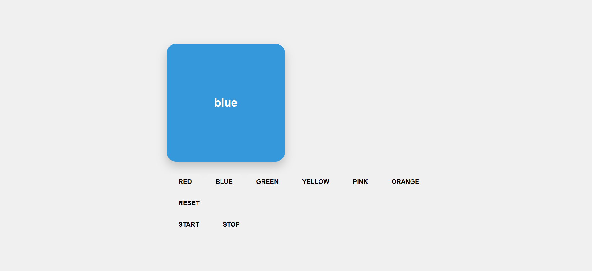

# 🎨 Interactive Color Picker App

A fun and interactive **React app** that lets you change the color of a box manually or automatically with a slideshow effect.

---

## 🖥 Demo



---

## 🚀 Features

- Manual color change with buttons  
- Dynamic buttons generated from a color array  
- Automatic slideshow of random colors  
- START / STOP slideshow buttons  
- Smooth CSS transitions and hover animations  
- Responsive and modern UI  

---

## 🛠 Technologies Used

- **React** (useState, useEffect, props)  
- **CSS** for animations, transitions, and styling  

---

## 💻 How to Run Locally

1. Clone the repo  
```bash
git clone https://github.com/gihankesar/color-picker-app.git
```
2. Install dependencies
```
npm install
```
3. Start the development server
```
npm start
```
✨ Author

Gihan Kesara
https://github.com/gihankesar


